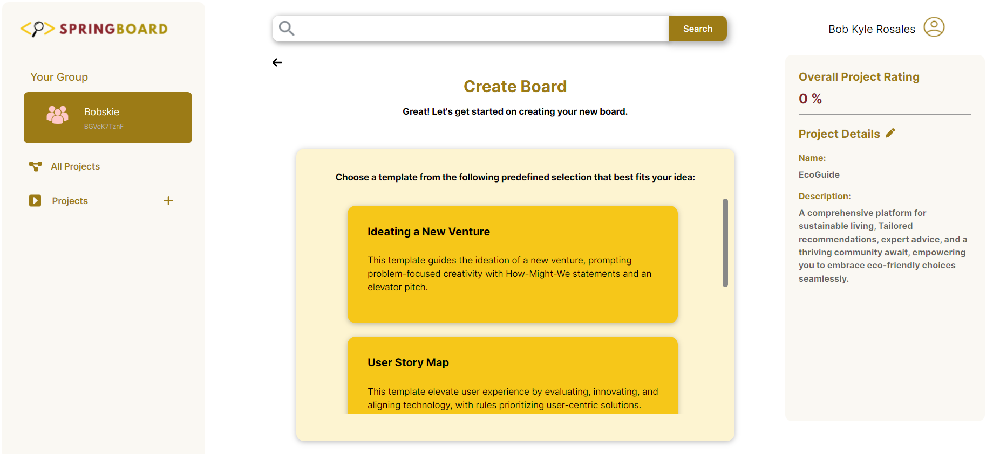
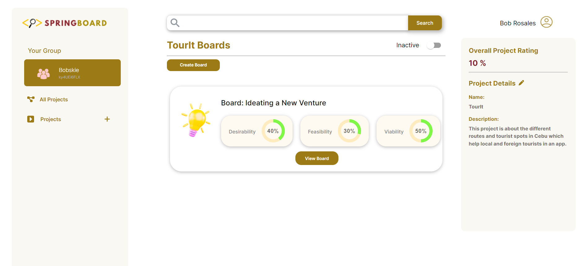
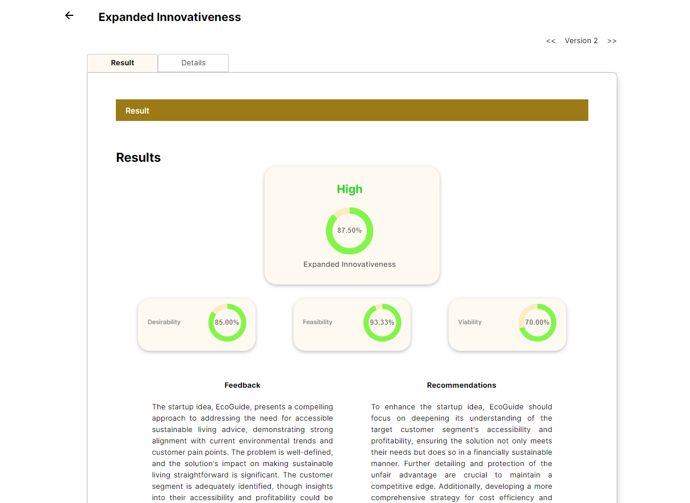

# SPringBoard

SPringBoard is a full-stack web application for evaluating startup ideas in an academic setting. It gives students a guided way to submit business ideas, lets teachers organize classrooms and review group work, and provides admins with reusable evaluation templates. Each submitted board is analyzed with OpenAI and scored across desirability, feasibility, and viability.

<p align="center">
  
  
  
</p>

## What The Project Does

- Supports three roles: `student`, `teacher`, and `admin`
- Organizes students into groups and teachers into classrooms
- Lets admins create structured idea-evaluation templates with rules and prompts
- Lets students create project boards from those templates
- Sends board content to OpenAI for AI-assisted evaluation
- Stores scores, feedback, and recommendations for each board version
- Tracks project-level scores and supports project search

## Core Workflow

1. An admin creates a template with instructions, rules, and structured content prompts.
2. A teacher creates classrooms and monitors the groups inside each class.
3. Students register, create or join groups, and add startup projects.
4. A student selects a template and submits a board for a project.
5. The backend evaluates the submission with OpenAI and stores:
   - `desirability`
   - `feasibility`
   - `viability`
   - written feedback
   - written recommendations
6. The frontend shows the results and keeps later board revisions tied to the same board history.

## Tech Stack

| Layer | Stack |
| --- | --- |
| Frontend | React 18, Vite, React Router, Axios, Fuse.js, MUI, Tiptap, React Quill |
| Backend | Django 4, Django REST Framework, PyJWT |
| Database | MySQL |
| AI integration | OpenAI Python SDK |
| Deployment config in repo | Vercel frontend, PythonAnywhere backend |

## Repository Layout

```text
SPringBoard/
|-- backend/
|   |-- backend/                 # Django project settings and URL config
|   |-- springboard_api/         # Models, serializers, controllers, routes
|   |-- manage.py
|   `-- requirements.txt
|-- frontend/
|   |-- public/
|   |-- src/
|   |   |-- components/
|   |   |-- context/
|   |   `-- pages/
|   |-- package.json
|   `-- vite.config.js
|-- images/                      # README screenshots
|-- springboard-1.sql            # MySQL dump / seed data
`-- Folder Organization.pdf      # legacy project notes
```

## Notable Backend Domains

- `Student`, `Teacher`, and `Admin` authentication
- `Classroom` management
- `Group` creation and join-code flow
- `Project` storage and scoring
- `ProjectBoard` versioning and AI evaluation results
- `Template` management for reusable startup-evaluation forms

## API Areas

The Django API is mounted at the root and exposes routes such as:

- `/api/register-student`, `/api/login-student`, `/api/logout-student`
- `/api/register-teacher`, `/api/login-teacher`, `/api/logout-teacher`
- `/api/register-admin`, `/api/login-admin`, `/api/logout-admin`
- `/api/classroom/...`
- `/api/group/...`
- `/api/project/...`
- `/api/projectboards/...`
- `/api/template/...`

## Local Development Setup

### Prerequisites

- Node.js 18+ and npm
- Python 3.10+ recommended
- MySQL
- An OpenAI API key

### 1. Backend Setup

```powershell
cd backend
python -m venv .venv
.venv\Scripts\activate
pip install -r requirements.txt
```

Create the env file expected by the current Django settings:

```text
backend/.eVar/.env
```

Suggested contents:

```env
SECRET_KEY=replace-me
DEBUG=True
ALLOWED_HOSTS=localhost 127.0.0.1
OPENAI_KEY=your-openai-api-key
```

Then update the MySQL connection in [`backend/backend/settings.py`](backend/backend/settings.py) to match your local database. The file already contains a commented local MySQL example you can use as a starting point.

If you want sample data, import [`springboard-1.sql`](springboard-1.sql). If you are starting fresh instead, create an empty database and run:

```powershell
python manage.py migrate
```

Start the backend:

```powershell
python manage.py runserver
```

### 2. Frontend Setup

```powershell
cd frontend
npm install
```

For local development, point the frontend to your local API by editing [`frontend/src/config.js`](frontend/src/config.js):

```js
const API_HOST = "http://127.0.0.1:8000";
```

Then run the frontend:

```powershell
npm run dev
```

The Vite app will usually be available at `http://localhost:5173`.

## Available Frontend Scripts

From the `frontend/` directory:

- `npm run dev` - start the Vite dev server
- `npm run build` - create a production build
- `npm run preview` - preview the production build locally
- `npm run lint` - run ESLint

## Configuration Notes

- The current repo is checked in with deployment-oriented values in [`frontend/src/config.js`](frontend/src/config.js) and [`backend/backend/settings.py`](backend/backend/settings.py). Update them before local development or redeployment.
- The backend loads environment variables from `backend/.eVar/.env`, which is a non-standard but intentional path in this codebase.
- Login endpoints set the JWT as an HTTP-only cookie and the frontend also stores the token in `localStorage`.
- The current login controllers set cookies with `secure=True` and `SameSite=None`. For plain `http://localhost` development, you may need development-friendly cookie settings depending on your browser.
- The AI evaluation logic currently lives in [`backend/springboard_api/controllers/ProjectBoardController.py`](backend/springboard_api/controllers/ProjectBoardController.py) and uses the `OPENAI_KEY` environment variable.
- For a real deployment, move hardcoded hosts, database credentials, and other secrets out of source files and into environment variables.

## Current State Of Testing

- Frontend linting is available through `npm run lint`
- Django includes a placeholder test file at [`backend/springboard_api/tests.py`](backend/springboard_api/tests.py)
- There is not yet a meaningful automated test suite in this repository

## Project Summary

SPringBoard is best understood as a classroom-oriented startup idea validation platform. It combines role-based dashboards, template-driven submission flows, AI-generated evaluation, and MySQL-backed project storage into a single system for incubating and reviewing student business ideas.
